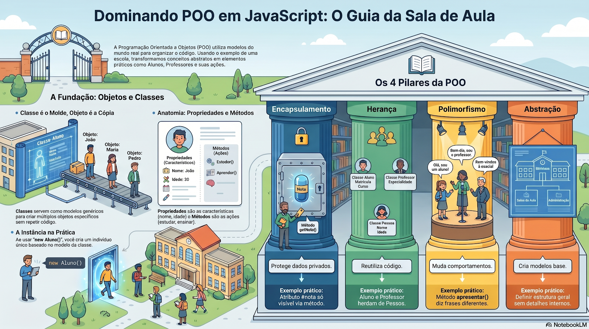

# 🏫 Dominando a Programação Orientada a Objetos (POO)

  
  
  

  
  
  

---

## 📑 Índice
1. [Sobre o Projeto](#-sobre-o-projeto)
2. [Objetivo da Atividade](#-objetivo-da-atividade)
3. [Os 4 Pilares da POO Analisados](#-os-4-pilares-da-poo-analisados)
4. [Linguagens Utilizadas](#-linguagens-utilizadas)
5. [Explicação da Estrutura](#-explicação-da-estrutura)
6. [Resultado Esperado](#-resultado-esperado)
7. [Requisitos de Execução](#-requisitos-de-execução)
8. [Como Acessar e Testar o Trabalho](#-como-acessar-e-testar-o-trabalho)
9. [Observações Importantes](#-observações-importantes)
10. [Contatos e Redes Sociais](#-contatos-e-redes-sociais)
11. [Conclusão Final](#-conclusão-final)
12. [Entrega](#-entrega)

---

## 🎯 Sobre o Projeto
Este projeto consiste em uma atividade prática para consolidar os conceitos fundamentais da Programação Orientada a Objetos (POO). O foco central é compreender como estruturar o código utilizando classes, objetos e os princípios da POO aplicados a um cenário do mundo real: o sistema de uma Escola.

Projeto desenvolvido individualmente por **Breno José de Oliveira** para o curso de **Técnico em Desenvolvimento de Sistemas** na **Escola SENAI "A. Jacob Lafer"**.

---

## ⚙️ Objetivo da Atividade
A atividade teve como finalidade aplicar a teoria da POO na prática, criando entidades que interagem entre si.
Foram executadas as seguintes implementações em duas linguagens diferentes (JavaScript e PHP):
- Criação de classes base e derivadas.
- Proteção de dados sensíveis.
- Sobrescrita de métodos para comportamentos específicos.
- Instanciação e comunicação entre múltiplos objetos.

---

## 🏛️ Os 4 Pilares da POO Analisados

  

Abaixo estão explicados os quatro pilares fundamentais da Programação Orientada a Objetos e como eles foram aplicados em nosso projeto.

### 1. Encapsulamento
O encapsulamento atua como um cofre, protegendo os dados internos de uma classe e permitindo o acesso apenas através de métodos seguros. Isso evita que propriedades sejam alteradas indevidamente.
**No nosso código:** Criamos a classe `Idade` onde a propriedade da idade é privada (usando `#idade` no JS e `private $idade` no PHP). Para definir ou ler essa idade, utilizamos os métodos `getIdade()` e `setIdade(novaIdade)`, que inclusive possui uma validação para impedir idades negativas.

### 2. Herança
A herança permite que uma classe "filha" herde características (propriedades) e ações (métodos) de uma classe "pai", promovendo a reutilização de código e evitando repetições.
**No nosso código:** Criamos as classes `Aluno`, `Professor`, `Diretor` e `Funcionario` que estendem (`extends`) a classe base `Pessoa`. Assim, um Aluno automaticamente possui nome, cargo e idade sem precisarmos reescrever essa estrutura do zero.

### 3. Polimorfismo
O polimorfismo permite que objetos de diferentes classes respondam ao mesmo método de formas diferentes. É a capacidade de "mudar o comportamento" de uma ação herdada.
**No nosso código:** A classe `Pessoa` possui o método `falar()`. No entanto, cada classe filha sobrescreve esse método para dizer uma frase específica de acordo com o seu cargo na escola. Quando chamamos `aluno1.falar()` ou `professor1.falar()`, a ação é a mesma, mas a saída no console/tela é diferente.

### 4. Abstração
A abstração consiste em focar no que é essencial para o sistema, ignorando os detalhes complexos e criando modelos base para representar o mundo real.
**No nosso código:** A classe `Pessoa` é a nossa abstração. Ela extrai os conceitos gerais e indispensáveis (ter um `nome`, `cargo`, `idade` e poder `falar`) que se aplicam a qualquer indivíduo dentro da escola, servindo de modelo estrutural genérico para a criação de entidades mais específicas.

---

## 🛠 Linguagens Utilizadas
Durante a atividade, os mesmos conceitos foram aplicados em dois ecossistemas distintos para demonstrar a universalidade da POO:
- **JavaScript (ES6+):** Utilizando a sintaxe moderna de `class`, `constructor`, `super` e campos privados com `#`.
- **PHP:** Utilizando a estrutura clássica de classes com modificadores de acesso `public`, `protected` e `private`, além da herança com `extends` e `parent::__construct`.

---

## 🧠 Explicação da Estrutura
O código foi estruturado para refletir a hierarquia de uma instituição de ensino. A lógica aplicada defende que, ao basear tudo em uma classe mãe (`Pessoa`), facilitamos a manutenção e a escalabilidade do sistema. Se no futuro precisarmos adicionar um `Coordenador`, basta estender a classe `Pessoa` sem alterar o código dos demais funcionários ou alunos.

---

## ✅ Resultado Esperado
Ao executar os arquivos, o console ou navegador exibirá a simulação da comunicação entre os objetos, com cada um se apresentando de forma personalizada devido ao polimorfismo, seguido do teste de encapsulamento da idade.
Exemplo de saída:
- *Olá, meu nome é Maria, tenho 16 anos e sou um aluno dedicado!*
- *Olá, meu nome é Carlos, tenho 40 anos e sou um professor dedicado!*
- *A idade do aluno é: 16*

---

## 💻 Requisitos de Execução
- **Para JavaScript:** Ambiente Node.js instalado na máquina.
- **Para PHP:** Um servidor local (como XAMPP/WAMP) ou o PHP CLI (Command Line Interface) instalado.

---

## 🚀 Como Acessar e Testar o Trabalho
1. Clone este repositório para sua máquina local.
2. **Executando o JavaScript:** Abra o terminal na pasta do projeto e rode o comando:
   `node atividade.js`
3. **Executando o PHP:** Abra o terminal e rode:
   `php atividade.php` (ou acesse via `localhost` no seu navegador web caso use XAMPP).
4. Analise as saídas impressas na tela, que comprovam o funcionamento dos pilares.

---

## ⚠️ Observações Importantes
- Os nomes de variáveis e a estrutura foram mantidos idênticos entre JS e PHP para facilitar o comparativo e a leitura.
- O conteúdo é destinado à fixação prática da sintaxe de classes e instâncias.
- Os professores responsáveis pela avaliação são **Paulo Camargo** e **Raul Porto**.

---

## 🤝 Contatos e Redes Sociais

  
  
  
  

---

## 🏁 Conclusão Final
A realização deste trabalho prático permitiu compreender claramente como os modelos do mundo real podem ser transpostos para o código de forma organizada. Dominar os pilares da POO é um passo essencial para escrever códigos limpos, modulares e seguros, características exigidas no mercado de desenvolvimento de software moderno.

---

## 📌 Entrega
Arquivos originais da entrega:
- `atividade.js` (Código fonte em JavaScript)
- `atividade.php` (Código fonte em PHP)
- `captura.png` (Imagem de referência visual dos pilares da POO)
- `README.md` (Este documento de documentação)
